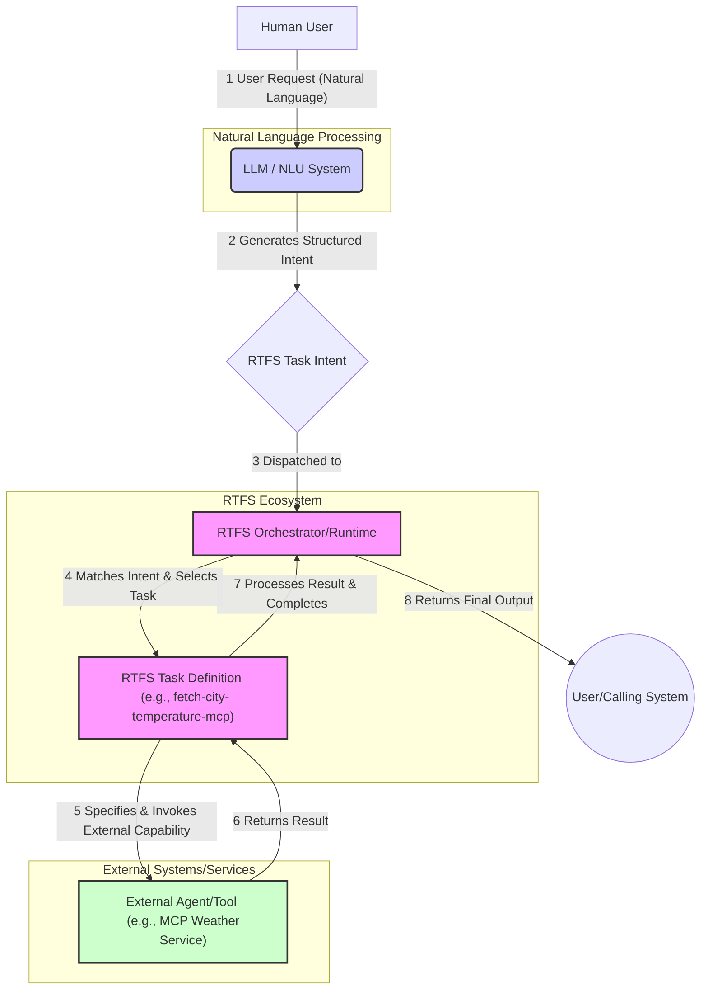

<!-- This file is overwritten with the new content. -->
# RTFS System Architecture: Request to Execution Flow

This document outlines the high-level architecture of an RTFS-based system, illustrating the typical flow from a human user's request to the execution of an RTFS task, potentially involving external agents or tools like those compliant with MCP (Model Context Protocol).

## Architecture Diagram

## Component Descriptions and Flow

The diagram illustrates the following steps and components:

1.  **Human User & User Request:**
    *   The process begins with a human user expressing a need or asking a question in natural language (e.g., "What's the current temperature in Paris in Celsius?").

2.  **LLM / NLU System:**
    *   This component (which could be a Large Language Model or another Natural Language Understanding system) receives the user's natural language request.
    *   Its primary role here is to parse the request, understand its semantic meaning, and translate it into a structured **RTFS Task Intent**. This intent captures the core action, parameters, and context from the user's query. (See `specs/examples.md`, Section 14.2 for an example intent).

3.  **RTFS Task Intent & Dispatch:**
    *   The generated RTFS Task Intent is a data structure (e.g., a map with keywords and values) that represents the user's goal in a machine-readable format, largely independent of how it will be executed.
    *   This intent is then dispatched to the RTFS Orchestrator/Runtime.

4.  **RTFS Orchestrator/Runtime & Task Selection:**
    *   The RTFS Orchestrator (or a runtime environment executing RTFS) receives the task intent.
    *   It maintains or has access to a registry of available RTFS Task Definitions.
    *   It matches the incoming intent to a suitable Task Definition based on the task's declared `:intent-schema`.
    *   Once a matching task is found (e.g., `fetch-city-temperature-mcp` from `specs/examples.md`), the orchestrator prepares to execute it, providing the relevant parts of the intent as input to the task.

5.  **RTFS Task Definition & External Capability Invocation:**
    *   The selected RTFS Task Definition is a script written in the RTFS language. It contains:
        *   `:intent-schema`: Defines the structure of intents it can handle.
        *   `:contracts`: Specifies its own input/output schemas and, crucially, any external capabilities it `:requires` (e.g., a specific MCP tool, an API endpoint). This is where the knowledge of *which* specific external tool to use is encoded.
        *   `:plan`: The actual logic, written in RTFS, to fulfill the intent.
    *   During execution of its `:plan`, the task may invoke external agents or tools as declared in its contracts. For an MCP tool, this involves formatting the request according to the MCP tool's input schema and sending it to the MCP agent.

6.  **External Agent/Tool Execution & Result Return:**
    *   The external agent (e.g., the MCP Weather Service) receives the request from the RTFS task, executes its own logic, and returns a result (e.g., a JSON payload with weather data).

7.  **Task Processes Result & Completes:**
    *   The RTFS task receives the result from the external agent.
    *   The task's `:plan` continues execution, potentially transforming or processing this result to match its own `:output-schema`.
    *   The task completes, yielding a final output.

8.  **Final Output to User/Calling System:**
    *   The RTFS Orchestrator/Runtime receives the final output from the executed task.
    *   This output is then delivered back to the human user (perhaps formatted for readability) or to the calling system that initiated the process.

This architecture allows for a clear separation of concerns:
*   Natural language understanding is handled by specialized NLU/LLM components.
*   Task intent provides a standardized interface.
*   RTFS tasks encapsulate the logic and explicit dependencies for fulfilling specific intents, including how to interact with various external systems.
